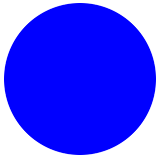
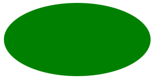
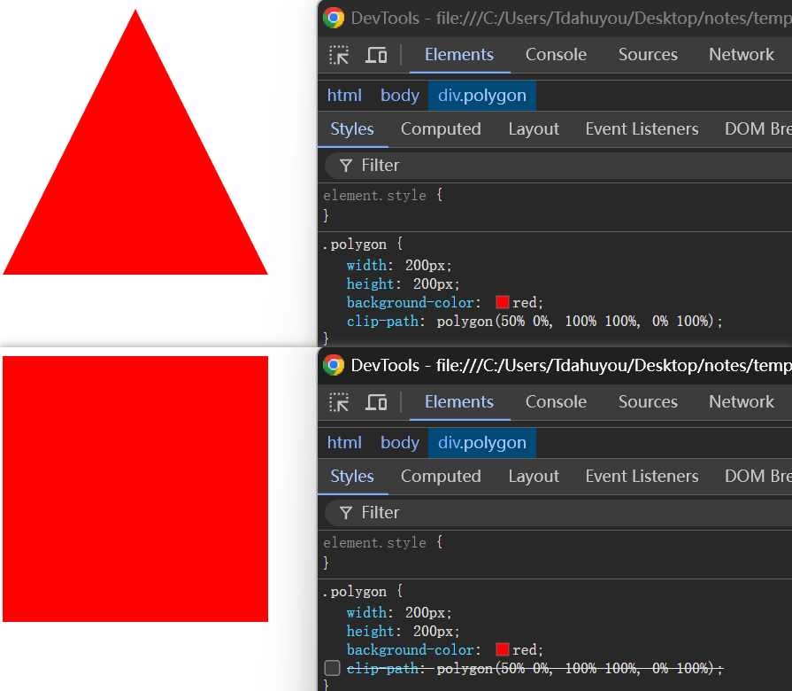
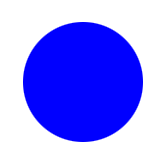
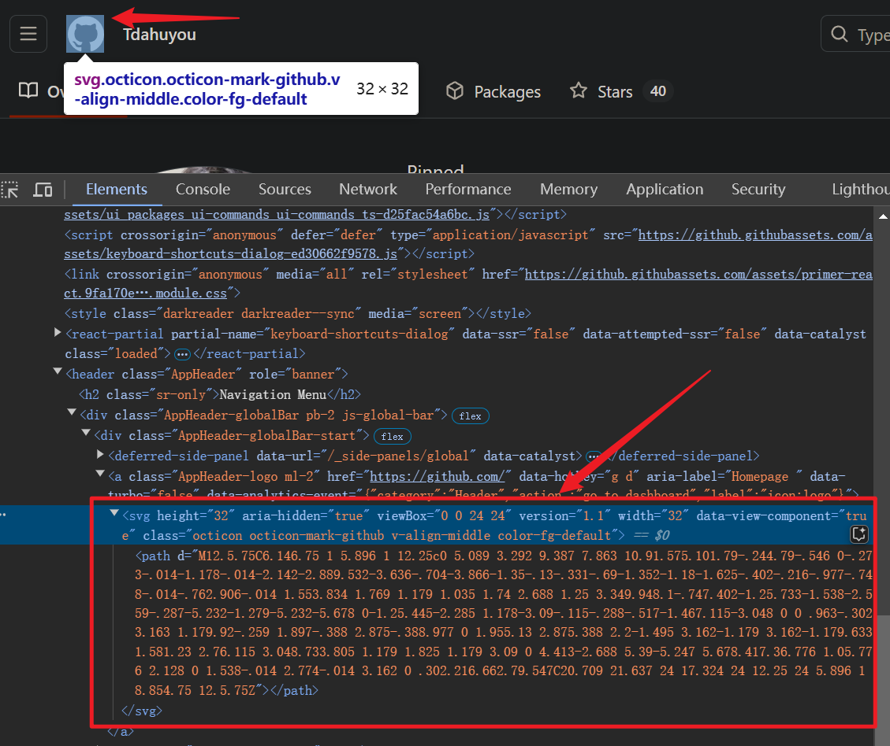
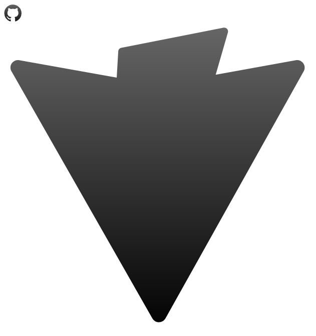

# [0106. clip-path](https://github.com/Tdahuyou/html-css-js/tree/main/0106.%20clip-path)

<!-- region:toc -->
- [1. 📒 clip-path 概述](#1--clip-path-概述)
- [2. 💻 demos.1 - 圆形裁剪](#2--demos1---圆形裁剪)
- [3. 💻 demos.3 - 椭圆形裁剪](#3--demos3---椭圆形裁剪)
- [4. 💻 demos.4 - 矩形裁剪](#4--demos4---矩形裁剪)
- [5. 💻 demos.2 - 多边形裁剪](#5--demos2---多边形裁剪)
- [6. 💻 demos.5 - 使用 svg 的裁剪路径来裁剪](#6--demos5---使用-svg-的裁剪路径来裁剪)
- [7. 💻 demos.6 - 使用 svg 的裁剪路径来裁剪 - vite、github](#7--demos6---使用-svg-的裁剪路径来裁剪---vitegithub)
<!-- endregion:toc -->
- clip-path 的写法非常灵活，笔记中的 demo 仅记录了其中一部分写法，更多写法可以参考 MDN。
- 虽然路径的绘制方式有很多，但其实如果我们掌握好了 svg 的话，使用 svg 来绘制路径，想要啥效果就画啥效果，也就是说啥路径都可以自行指定。
- https://developer.mozilla.org/en-US/docs/Web/CSS/clip-path
  - mdn - css clip-path 属性
- https://caniuse.com/?search=clip-path
  - can i use clip-path

## 1. 📒 clip-path 概述

- `clip-path` 是 CSS 中的一个属性，**用于定义元素的可见区域（即剪裁区域）**。
- **通过 `clip-path`，你可以控制元素的哪些部分是可见的，哪些部分是被隐藏的。**
  - 这在创建复杂的图形形状、实现特殊的视觉效果等方面非常有用。
- 兼容性
  - `clip-path` 在现代浏览器中得到了广泛支持，兼容性还算不错。
  - 
- `clip-path` 会影响元素的布局和渲染，因此在复杂布局中使用时要特别小心。
- 使用 `clip-path` 时，确保元素的内容仍然可访问，特别是在涉及文本或交互元素时。
- 基本语法：`clip-path: <clip-source> | [ <basic-shape> || <geometry-box> ] | none;`
  - **`<clip-source>`**: 指定一个引用了 `<clipPath>` 元素的 URL，该元素定义了剪裁区域。通常用于 SVG 形状。
  - **`<basic-shape>`**: 使用基本几何形状来定义剪裁区域，例如圆形、椭圆、多边形等。
  - **`<geometry-box>`**: 定义剪裁区域的参考盒，例如 `margin-box`、`border-box`、`padding-box` 或 `content-box`。
  - **`none`**: 不应用任何剪裁，元素完全可见。

## 2. 💻 demos.1 - 圆形裁剪

```html
<!-- 
clip-path: circle(50% at 50% 50%);
  第一个参数是半径，可以是百分比或长度单位。
  第二个参数是圆心的位置，格式为 at x y，x 和 y 可以是百分比或长度单位。 
-->
<!DOCTYPE html>
<html lang="en">
  <head>
    <meta charset="UTF-8" />
    <meta name="viewport" content="width=device-width, initial-scale=1.0" />
    <title>Document</title>
    <style>
      .circle {
        width: 200px;
        height: 200px;
        background-color: blue;
        clip-path: circle(50% at 50% 50%);
      }
    </style>
  </head>
  <body>
    <div class="circle"></div>
  </body>
</html>
```

- 未裁剪：
  - 
- 裁剪：
  - 

## 3. 💻 demos.3 - 椭圆形裁剪

```html
<!-- 
clip-path: ellipse(50% 50% at 50% 50%);
- 第一和第二个参数分别是水平和垂直半径，可以是百分比或长度单位。
- 第三和第四个参数是椭圆中心的位置，格式为 `at x y`，x 和 y 可以是百分比或长度单位。
-->
<!DOCTYPE html>
<html lang="en">
  <head>
    <meta charset="UTF-8" />
    <meta name="viewport" content="width=device-width, initial-scale=1.0" />
    <title>Document</title>
    <style>
      .ellipse {
        width: 200px;
        height: 100px;
        background-color: green;
        clip-path: ellipse(50% 50% at 50% 50%);
      }
    </style>
  </head>
  <body>
    <div class="ellipse"></div>
  </body>
</html>
```

- 未裁剪：
  - 
- 裁剪：
  - 

## 4. 💻 demos.4 - 矩形裁剪

```html
<!-- 
clip-path: inset(10px 20px 30px 40px round 10px);
- 参数分别表示上、右、下、左的内边距，可以是长度单位或百分比。
- `round` 关键字后跟一个值，表示圆角的半径。
-->
<!DOCTYPE html>
<html lang="en">
  <head>
    <meta charset="UTF-8" />
    <meta name="viewport" content="width=device-width, initial-scale=1.0" />
    <title>Document</title>
    <style>
      .rect {
        width: 200px;
        height: 100px;
        background-color: yellow;
        clip-path: inset(10px 20px 30px 40px round 10px);
      }
    </style>
  </head>
  <body>
    <div class="rect"></div>
  </body>
</html>
```

- 未裁剪：
  - 
- 裁剪：
  - 

## 5. 💻 demos.2 - 多边形裁剪

```html
<!-- 
clip-path: polygon(50% 0%, 100% 100%, 0% 100%);
参数是顶点的坐标列表，每个坐标由 x 和 y 组成，可以是百分比或长度单位。
-->
<!DOCTYPE html>
<html lang="en">
  <head>
    <meta charset="UTF-8" />
    <meta name="viewport" content="width=device-width, initial-scale=1.0" />
    <title>Document</title>
    <style>
      .polygon {
        width: 200px;
        height: 200px;
        background-color: red;
        clip-path: polygon(50% 0%, 100% 100%, 0% 100%);
      }
    </style>
  </head>
  <body>
    <div class="polygon"></div>
  </body>
</html>
```

- 对比是否加 clip-path 的效果：
  - 

## 6. 💻 demos.5 - 使用 svg 的裁剪路径来裁剪

- 准备一个用户裁剪的 svg 模块

```xml
<svg xmlns="http://www.w3.org/2000/svg" version="1.1">
  <!-- 
  这里的 #c1 准备用来裁剪，后续会在 5.svg 中被引用。
  它是不可见的，仅仅是一个裁剪的路径。
  这里的路径是一个圆形。
  -->
  <defs>
    <clipPath id="c1">
      <circle cx="50" cy="50" r="40" />
    </clipPath>
  </defs>
  <!-- 
  如果你想要预览路径，可以把下面的注释去掉。
  红色的描边儿就是裁剪的路径。
  -->
  <circle cx="50" cy="50" r="40" stroke="red" stroke-width="2" fill="blue" />
</svg>
```

- 裁剪路径预览；
  - 
- 在 demo/5.html 中将 svg 路径用于裁剪

```html
<!-- 
clip-path: url(1.svg#c1);
使用 SVG 來做 clip-path

注意：
需要使用服务的方式（比如 open with live server）来打开 html，否则会导致 1.svg 找不到。
-->
<!DOCTYPE html>
<html lang="en">
  <head>
    <meta charset="UTF-8" />
    <meta name="viewport" content="width=device-width, initial-scale=1.0" />
    <title>Clip Path Demo</title>
    <style>
      .clipped {
        width: 100px;
        height: 100px;
        background-color: blue;
        clip-path: url(1.svg#c1);
      }
    </style>
  </head>
  <body>
    <div class="clipped"></div>
  </body>
</html>
```

- 未裁剪：
  - 
- 裁剪：
  - 

## 7. 💻 demos.6 - 使用 svg 的裁剪路径来裁剪 - vite、github

```html
<!DOCTYPE html>
<html lang="en">
  <head>
    <meta charset="UTF-8" />
    <meta name="viewport" content="width=device-width, initial-scale=1.0" />
    <title>Clip Path Demo</title>
    <style>
      .github-clip {
        width: 30px;
        height: 30px;
        background: linear-gradient(to bottom, #666666, #000000); /* 渐变色 灰到黑 */
        clip-path: url(github.svg#github-clip);
      }

      .vite-clip {
        width: 410px;
        height: 410px;
        background: linear-gradient(to bottom, #666666, #000000); /* 渐变色 灰到黑 */
        clip-path: url(vite.svg#vite-clip);
      }
    </style>
  </head>
  <body>
    <div class="github-clip"></div>
    <div class="vite-clip"></div>
  </body>
</html>
```

- vite、github 的 svg 资源可以从官网去趴 svg 源码。
  - vite svg - https://vite.dev/logo.svg
    - 
  - GitHub svg
    - 
- 未裁剪：
  - 
- 裁剪：
  - 